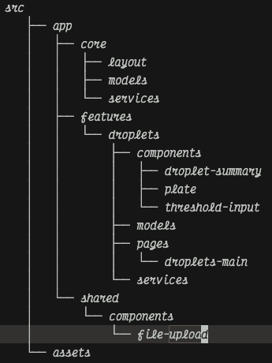

# Plate Data Viewer

## Overview
Web application for loading and viewing plate well information. Currently supports display of well 
droplet info, with indication for counts below the threshold (default 100). JSON plate data files 
must use the schema defined below. 

## Getting Started
Acquire the application source code by downloading the repo as a zip file or by cloning to a local
directory. Use the following commands to start the app:

```shell
# clone or unzip...
cd droplets
npm install
ng serve
```
Once the server is running, open your browser and navigate to `http://localhost:4200/`.

## Unit Tests
The service class unit tests can be executed with the command: `ng test`

## Project Conventions
- The project adheres to some design conventions. The first being it uses a feature slice folder
structure, which co-locates all of the pages, components, models, and services for a given feature 
within a single folder. For example, the first feature, for viewing droplet counts is located in
the `/src/app/features/droplets` directory. 



- The other folders in `/src` are `core` and `shared` which hold cross-cutting items and reusable items respectfully. This helps other devs easily orient themselves, and makes adding new code more easy
- The project uses standalone components because it is less code to maintain and easier for new developers to quickly become comfortable in the codebase.
- Use of the `inject()` method over ctor injection is more readable and can be used in functions as well. This
helps keep the code concise. One other advantage is that the fields initialize before the ctor, which can eliminate chances for null or undefined errors.
- Centralized error handling using Angular's `GlobalErrorHandler` makes displaying errors from anywhere they are thrown easier. This removes the need to update individual try catches through out the code. So, for example, adding structured logging to an outside service like Splunk could be done in one place for all errors.
- No libraries. The project does not currently use any UI control libraries. This is due to the simplicity of the application and its current requirements. At some point it could become more practical to use a library. (I will note that making the upload control took an inordinate amount of time compared to the rest of the app)
- State is managed using signals. With an app of this size, and even with additional features, there is not necessarily a need for NgRX or RxJs. If at some point persistent state across features is needed then a global store would make sense. More complex features could also indicate a need for use of Observables but not at this point. This saves size and complexity.

## To Do 
- Add a Github Action to build and deploy the app to an S3 bucket (or similar).
- Add environment directory with production configuration values as needed.
- Add ESlint with a precommit hook to ensure code style is maintained.
- Add e2e tests with playwright or cypress.

This project was generated using [Angular CLI](https://github.com/angular/angular-cli) version 21.0.0.